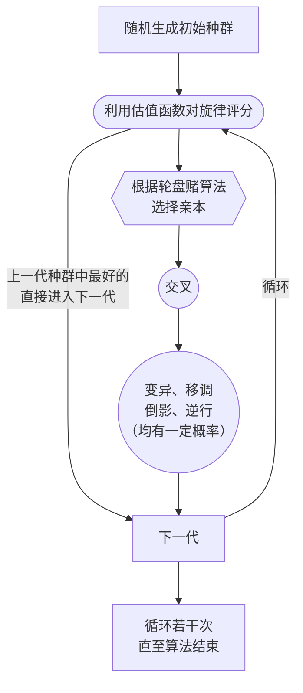

# 音乐与数学 大作业

> [!NOTE]
> 本项目已截止，不再接受任何提交。感谢各位组员的付出。

- [音乐与数学 大作业](#音乐与数学-大作业)
  - [文件结构](#文件结构)
  - [`Python`环境配置](#python环境配置)
  - [代码结构](#代码结构)
    - [`algorithm`](#algorithm)
      - [`algorithm.fitness`](#algorithmfitness)
        - [评分函数](#评分函数)
        - [惩罚函数](#惩罚函数)
      - [`algorithm.operation`](#algorithmoperation)
      - [`algorithm.init`](#algorithminit)
      - [`algorithm.genetic`](#algorithmgenetic)
    - [`melody`](#melody)
    - [`util`](#util)
  - [注意事项](#注意事项)

## 文件结构

其他文件/文件夹功能如下：

- `./resource/`: 本项目参考文献。
- `./src/`: 本项目源代码位置。
- `./report/`: 本项目报告。
- `./example/`: 生成部分音乐音频及五线谱示例。
- `./dist/`: 发行版。
- `./README.md`: 本文件

## `Python`环境配置

本项目需要`mido`库与`pygame`库的安装。环境配置如下：

```ps
conda create -n music python=3.10
conda activate music
pip install mido
pip install pygame
```

## 代码结构

> [!TIP]
> `python`中`import`一个文件夹，会默认导入文件夹下的库`__init__.py`

在`./src`目录下，各文件/文件夹功能如下：

### [`algorithm`](./src/algorithm/)

遗传算法所在文件夹。

```python
from algorithm import RandomGenerator, GeneticAlgorithm, operation, fitness
```

遗传算法流程图如下：



#### [`algorithm.fitness`](./src/algorithm/fitness.py)

适应度函数。**推荐增加内容**。

总的来说分为两种：一种是分数（score），介于0到1之间，越高越好，对所有旋律都适用，用于指导旋律进化方向；另一种是惩罚（penalty），对于大部分的音乐惩罚都为0，只有对少数不希望出现的音乐返回一个正值。

##### 评分函数

- 音程协和：对相邻音符计算音程

  ```python
  def interval_score(melody: Melody) -> float:...
  ```

- 符合调性：希望音符尽量落在同一个大/小调上

  ```python
  def tonality_score(melody: Melody, mode: str) -> float:...
  ```

- 节奏协和：希望相邻小节的节奏型尽量相近

  ```python
  def rhythm_score(melody: Melody) -> float:
  ```

- 旋律中的稳定与不稳定音：
  > 采用现代旋律创作中的"稳定-不稳定-稳定"理论。
    在大调式中，将主和弦的三个音视为稳定音，二、六音视为较不稳定音，四、七音视为极不稳定音。
  
  旋律要以稳定音开始、以稳定音结束：

  ```python
  def boundary_score(melody: Melody) -> float:
  ```

  旋律允许的变化如下：
  - 稳定 - 较不稳定 - 稳定
  - 稳定 - 极不稳定 - 稳定
  - 稳定 - 较不稳定 - 极不稳定 - 稳定
  - 稳定 - 极不稳定 - 较不稳定 - 稳定

  返回对此理论的符合程度：

  ```python
  def stable_score(melody: Melody) -> float:
  ```

##### 惩罚函数

- 音符密度：不希望音符过于稀疏或过于密集

  ```python
  def density_penalty(melody: Melody) -> float:
  ```

- 尾音延长：不希望音乐戛然而止（以八分音符或休止符结尾）

  ```python
  def stop_penalty(melody: Melody) -> float:
  ```

- 休止符：不希望休止符干扰乐曲进行，但不知道休止符在哪里出现合适，不如暂时避免任何休止符

  ```python
  def rest_penalty(melody: Melody) -> float:
  ```

- 连续音符：不希望连续过多的八分音符

  ```python
  def consecutive_penalty(melody: Melody, threshold: int = 8) -> float:
  ```

- 音高范围：不希望旋律中的音符音高相差过多

  ```python
  def range_penalty(melody: Melody, threshold: int) -> float:
  ```

- 音符种类数：不希望旋律中的音符种类过少

  ```python
  def variety_penalty(melody: Melody, threshold: int) -> float:
  ```

- 孤立音符：不希望有孤立的音符（即和两端的音符音高差距过大）

  ```python
  def lonely_penalty(melody: Melody, threshold: int = 9) -> float:
  ```

#### [`algorithm.operation`](./src/algorithm/operation.py)

交叉、变异函数。**推荐增加内容**。

- 单点杂交

  ```python
  def one_point_cross(a: Melody, b: Melody, index: int) -> Melody:...
  ```

- 两点杂交

  ```python
  def two_points_cross(a: Melody, b: Melody, indices: Tuple[int, int]) -> Melody:...
  ```

- 单点变异

  ```python
  def one_point_mutate(
      melody: Melody,
      index: int,
      *,
      note_list: Sequence = Note.NAME_LIST,
  ) -> None:
  ```

- 移调

  ```python
  def transpose(
      melody: Melody,
      delta: Optional[int] = None,
      indices: None | Tuple[int, int | None] = None,
  ) -> None:
  ```

- 倒影

  ```python
  def inverse(
      melody: Melody,
      s: Optional[int] = None,
      indices: None | Tuple[int, int | None] = None,
  ) -> None:    
  ```

- 逆行

  ```python
  def retrograde(
      melody: Melody,
      indices: None | Tuple[int, int | None] = None,
  ) -> None:
  ```

#### [`algorithm.init`](./src/algorithm/init.py)

初始种群生成。现在只有随机生成初始种群，未来有需要可以增加从文件导入。

#### [`algorithm.genetic`](./src/algorithm/genetic.py)

遗传算法框架。

### [`melody`](./src/melody/)

主要工作是实现`midi`文件的保存与播放、`Note`, `Melody`类

```python
from melody import Note, Melody, save_midi, play_midi
```

- `Note`类：音符。按[作业要求](./resource/projects23b.pdf)中的说明，有 $29$ 种，编号 $0$ 到 $28$ ，其中
    $$S=\left\lbrace\text{F}_3,\sharp\text{F}_3,\cdots,\sharp\text{F}_5,\text{G}_5\right\rbrace$$
    共 $27$ 种音级，编号 $1$ 到 $27$; 休止符编号 $0$; 延长符号编号 $28$. 以上这些音符默认为8分音符，延长符号将它前面一个音符的时值加上一个8分音符的长度。目前支持转化为`str`（即打印出来）；可以通过`note.id`访问编号。

- `Melody`类：旋律。旋律就是一系列`Note`的列表。

### [`util`](./src/util/)

一些小工具，但与代码框架无关。必要时可以自行增加，并在此处简要描述。小工具罗列如下

- `RouletteSelection`类：轮盘赌算法。

## 注意事项

1. 组员编写函数需要在函数前加上自己的名字。（不加就默认是组长写的了）
2. 尽量不要大幅改动框架，或删除已有函数（除非必要）。
3. 遇到`bug`或有新的提议（关于新功能、对框架的意见），可以直接在群里交流。
4. 命名最好看到函数就知道什么意思，特别之处要加注释。
